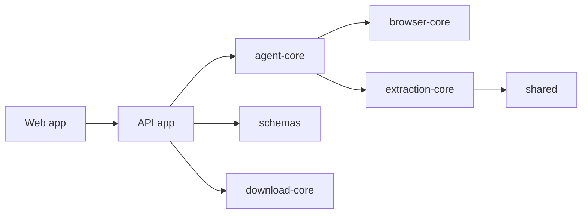

# Architecture

Web-Pilot is organized as a Turborepo. The applications use shared packages
for task state, browser control, extraction, downloads, and schemas.

`schemas` defines state and event contracts. `agent-core` validates and
replans work, `browser-core` owns browser actions, and `extraction-core` turns
observed pages into structured content. `download-core` handles manifests,
naming, deduplication, and verification. Cross-cutting helpers live in
`shared`.

When changing a contract, update the schema and run the integration tests.
Browser and extraction changes should include coverage under
`tests/integration`.
