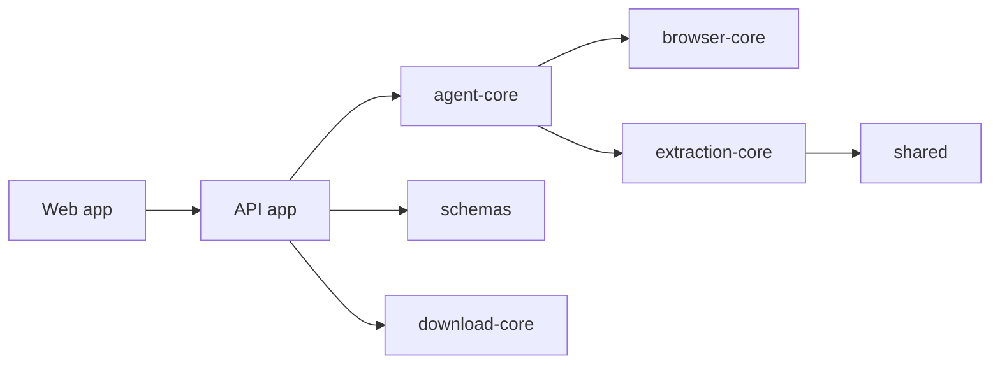
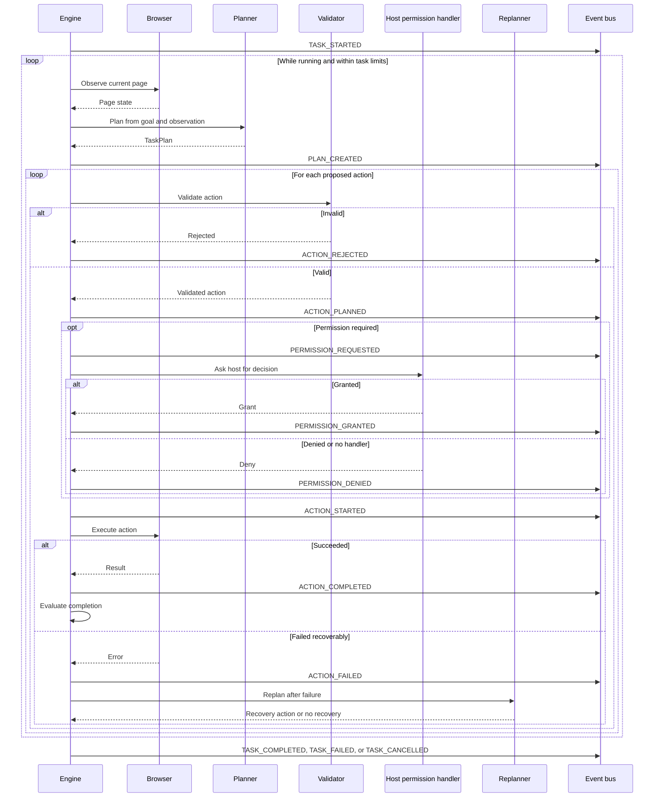

# Architecture

Web-Pilot is organized as a Turborepo. The applications use shared packages
for task state, browser control, extraction, downloads, and schemas.

`schemas` defines state and event contracts. `agent-core` validates and
replans work, `browser-core` owns browser actions, and `extraction-core` turns
observed pages into structured content. `download-core` handles manifests,
naming, deduplication, and verification. Cross-cutting helpers live in
`shared`.

## Agent lifecycle

The engine observes the page before planning. It validates each proposed
action, requests permission when required, executes accepted actions, then
evaluates the result. If execution fails recoverably, the replanner can supply
a replacement action and the loop observes again. Event labels below are the
ones emitted by the engine; `PAGE_CHANGED` and `TASK_QUEUED` are schema event
types but are not currently emitted by this loop.

Extraction may emit `ITEM_FOUND`; download operations can emit
`DOWNLOAD_STARTED`, `DOWNLOAD_COMPLETED`, or `DOWNLOAD_FAILED`. Those event
types are defined in `packages/schemas/src/events.ts`.

When changing a contract, update the schema and run the integration tests.
Browser and extraction changes should include coverage under
`tests/integration`.
