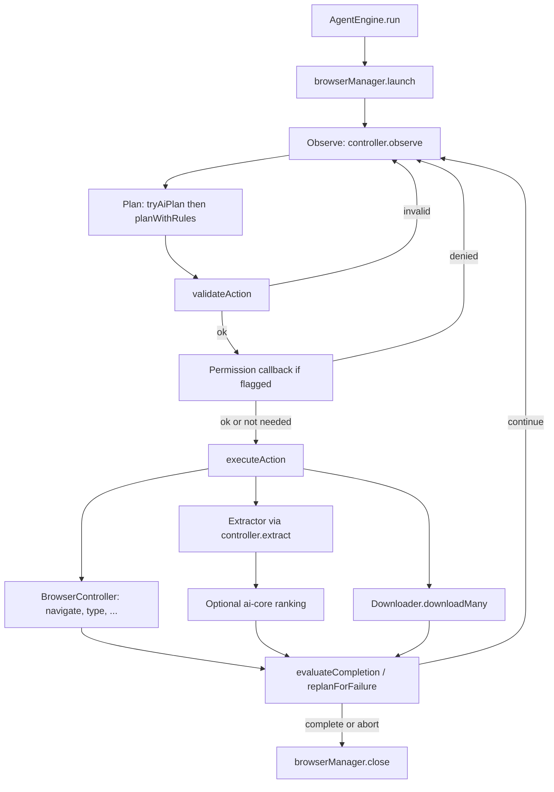
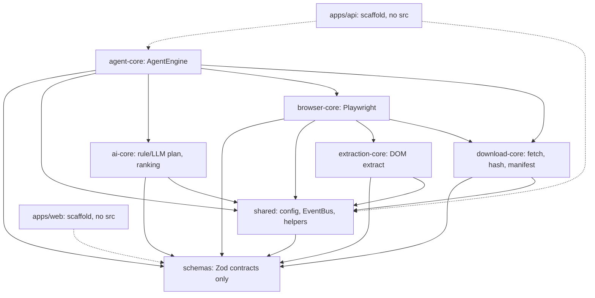

# WebPilot architecture

This page is a map of **what the TypeScript packages do today**, how a task moves through them, and where a new contributor can start. It is based on current imports and calls, not the long-term product vision.

Setup, scripts, and “what works before the dashboard exists” live in the [README](../README.md) and [CONTRIBUTING.md](../CONTRIBUTING.md). This document does not repeat those instructions.

## What is implemented vs planned

| Layer | Status | What that means |
| --- | --- | --- |
| `packages/schemas`, `shared`, `ai-core`, `browser-core`, `extraction-core`, `download-core`, `agent-core` | **Implemented** | Real source. The agent loop can plan, validate, drive Playwright, extract, rank, and download. |
| `apps/test-site` | **Implemented** | Local fixture site used by integration tests. |
| `apps/api` | **Scaffold** | `package.json` lists Elysia, Drizzle, and workspace deps. There is **no** `src/` yet — no HTTP server, SQLite store, or WebSocket broadcaster. |
| `apps/web` | **Scaffold** | SolidStart deps only. There is **no** dashboard source. |
| Persistence, live event streaming, session replay, plugin API, CLI | **Future** | Schemas and config *names* exist (`TaskSchema`, `WebSocketMessageSchema`, `WEBPILOT_DB_URL`). Nothing wires them yet. |

`EventBus` comments mention a WebSocket broadcaster and a SQLite event store as **intended** consumers. Today the bus is an in-process pub/sub: listeners you attach in the same process receive `AgentEvent` objects. The API/dashboard are the planned hosts, not current ones.

## How a task actually runs

A host process constructs [`AgentEngine`](../packages/agent-core/src/engine.ts) with a `BrowserManager`, `BrowserController`, `EventBus`, and optional `Downloader`, `ModelManager`, `EmbeddingManager`, and `onPermissionRequest` callback. `run(taskId, prompt)` then:

1. Emits `TASK_STARTED` and launches the browser.
2. Loops while steps and wall-clock time remain: **observe → plan → execute each step**.
3. Each step is **validate → permission → execute → observe/evaluate**. Failures go through [`replanForFailure`](../packages/agent-core/src/replanner.ts).
4. Closes the browser in `finally`.

Checked against current source:

- Planning tries the local model first, then [`planWithRules`](../packages/ai-core/src/rule-planner.ts) (`engine.ts` `planFromStrategy` / `tryAiPlan`).
- Validation is [`validateAction`](../packages/agent-core/src/validator.ts): Zod `ActionSchema`, then runtime policy (http(s) URLs, download count cap, optional host allow-list). Sensitive `type`+submit, large/confirmed downloads, and some consequential clicks set `needsPermission`.
- Permission is a callback, not a UI. If permission is required and `onPermissionRequest` is missing, the engine throws `PERMISSION_DENIED`. A “remember” grant is cached **in memory for that run only**.
- Browser actions call `BrowserController` (`navigate`, `click`, `type`, …). Extract calls `controller.extract`, which constructs [`Extractor`](../packages/extraction-core/src/extractor.ts). The engine then ranks items via `ai-core` when the extract action has a `query`.
- Downloads call `this.options.downloader.downloadMany` in the engine — HTTP `fetch`, not the Playwright session — then hash, MIME-check, dedupe, and write a per-task `manifest.json`.
- `agent-core` lists `@webpilot/extraction-core` in `package.json` but **does not import it**. Extraction is reached through `browser-core`.

Completion today is narrow: a `download` step can finish the task when enough files succeed; an `extract` step can finish when ranked `candidates` is non-empty. Other action types do not mark the task complete by themselves.

## Package imports (not the product diagram)

Solid arrows are **real TypeScript imports**. Dashed arrows are workspace `package.json` dependencies with **no application source** yet (`apps/api`, `apps/web`). `apps/test-site` is a fixture server with no package imports.

`schemas` performs no I/O. `shared` depends on `schemas` (errors, a few types) and owns process-wide [`config`](../packages/shared/src/config.ts). `ai-core` does not import the browser or downloader.

## Schemas, config, and events in plain language

**Schemas** (`@webpilot/schemas`) are the shared vocabulary: what an action may look like, what an event contains, what “agent state” and “page state” mean, and the structured error codes. Other packages import the types and Zod objects; they do not each invent their own JSON.

| Idea | Where | Plain meaning |
| --- | --- | --- |
| Action | [`actions.ts`](../packages/schemas/src/actions.ts) | One allowed step: `navigate`, `click`, `type`, `press`, `scroll`, `extract`, `download`, `wait`. The model must emit this shape — not raw JS or shell. |
| Task plan | [`task.ts`](../packages/schemas/src/task.ts) | Goal + ordered actions + `source` (`rule` / `ai` / `replan`). `TaskSchema` / `CreateTaskRequestSchema` are ready for a future API. |
| Agent state | [`state.ts`](../packages/schemas/src/state.ts) | Compact run memory: URL, candidates, downloads, step count, last error. Kept small so it can be summarized for the planner. |
| Page state | [`page.ts`](../packages/schemas/src/page.ts) | Counts and short interactive labels after an action — **not** raw HTML. |
| Agent event | [`events.ts`](../packages/schemas/src/events.ts) | One timeline row (`PLAN_CREATED`, `ACTION_*`, `PERMISSION_*`, `DOWNLOAD_*`, …) with a monotonic `sequence`. |
| WebSocket envelope | [`events.ts`](../packages/schemas/src/events.ts) | `hello` / `event` / `task` / `error` / `pong` — **schema only** until the API exists. |
| Download manifest | [`downloads.ts`](../packages/schemas/src/downloads.ts) | Provenance written next to saved files (`download-core` already does this). |
| Error | [`errors.ts`](../packages/schemas/src/errors.ts) | Typed `WebPilotError` with a `recoverable` flag the replanner reads. |

**Config** is environment variables with defaults ([`.env.example`](../.env.example), [`loadConfig`](../packages/shared/src/config.ts)): listen address, data/model paths, `WEBPILOT_DB_URL` (unused until persistence exists), browser engine/timeouts, step/download/size/time caps, local model ids, download allow-list, and log level. Schema-level caps (`ACTION_CAPS`) reject oversized AI output before runtime policy runs.

**Events** are produced by `AgentEngine.emit` onto [`EventBus`](../packages/shared/src/event-bus.ts). `emit` is synchronous; a throwing listener is swallowed so it cannot break the loop. There is no built-in persistence or network fan-out.

## Local models are not offline browsing

- **Planning** can use an in-process Transformers.js model (`ModelManager`). If weights are missing it tries a remote load, then falls back to the rule planner. Inference is local **after** the files are on disk; the first load may use the network.
- **Ranking** can use a local embedding model the same way, or lexical scores only.
- **Browsing** is Playwright against real `http(s)` pages. That is ordinary web traffic (and so is `Downloader` `fetch`).
- There is **no** implemented “zero network” or airplane-mode browsing mode. Disabling AI (`WEBPILOT_AI_ENABLED=false`) still leaves navigation and downloads needing the network for remote sites.
- Design intent is local-first inference and no cloud LLM API in the engine. That is not the same as “the process never opens a socket.”

## Where your skills fit

| You are comfortable with… | Start here | Typical first change |
| --- | --- | --- |
| Frontend / UI | [`apps/web`](../apps/web/package.json) (empty scaffold), [`events.ts`](../packages/schemas/src/events.ts), [`state.ts`](../packages/schemas/src/state.ts) permission types | Build dashboard pieces against the existing event/task/permission contracts. Do not assume a live WebSocket yet. |
| Backend / API | [`apps/api`](../apps/api/package.json) (empty scaffold), [`engine.ts`](../packages/agent-core/src/engine.ts), [`event-bus.ts`](../packages/shared/src/event-bus.ts), [`task.ts`](../packages/schemas/src/task.ts) | Host `AgentEngine`, persist tasks/events (Drizzle/`WEBPILOT_DB_URL` is reserved), optionally bridge `EventBus` → `/ws/tasks/:id`. |
| Browser automation | [`browser-core`](../packages/browser-core/src), [`extraction-core`](../packages/extraction-core/src) | New actions stay schema-first; locators and extractors stay deterministic (no AI in these packages). |
| Planning / ranking | [`ai-core`](../packages/ai-core/src) | Rule planner, plan parsing, lexical/semantic ranking. The engine must still work when the model is off. |
| Safety / files | [`validator.ts`](../packages/agent-core/src/validator.ts), [`download-core`](../packages/download-core/src) | Allow-lists, MIME/size checks, naming, manifests. |
| Tests | [`tests/unit`](../tests/unit), [`tests/integration`](../tests/integration), [`apps/test-site`](../apps/test-site) | Unit tests do not need the dashboard. Integration tests need Playwright + `bun run test-site`. An empty Vitest run is not coverage. |
| Docs | This file, [README](../README.md) | Keep claims aligned with imports. Do not add generated diagram images or a Mermaid build dependency. |

## Source index

| Topic | File |
| --- | --- |
| Agent loop | [`packages/agent-core/src/engine.ts`](../packages/agent-core/src/engine.ts) |
| Validate / permission flags | [`packages/agent-core/src/validator.ts`](../packages/agent-core/src/validator.ts) |
| Observe / summaries | [`packages/agent-core/src/observer.ts`](../packages/agent-core/src/observer.ts) |
| Replan | [`packages/agent-core/src/replanner.ts`](../packages/agent-core/src/replanner.ts) |
| Rule planner | [`packages/ai-core/src/rule-planner.ts`](../packages/ai-core/src/rule-planner.ts) |
| Local model load | [`packages/ai-core/src/model-manager.ts`](../packages/ai-core/src/model-manager.ts) |
| Playwright actions + extract | [`packages/browser-core/src/browser-controller.ts`](../packages/browser-core/src/browser-controller.ts) |
| Downloads | [`packages/download-core/src/downloader.ts`](../packages/download-core/src/downloader.ts) |
| Event bus | [`packages/shared/src/event-bus.ts`](../packages/shared/src/event-bus.ts) |
| Config | [`packages/shared/src/config.ts`](../packages/shared/src/config.ts) |
